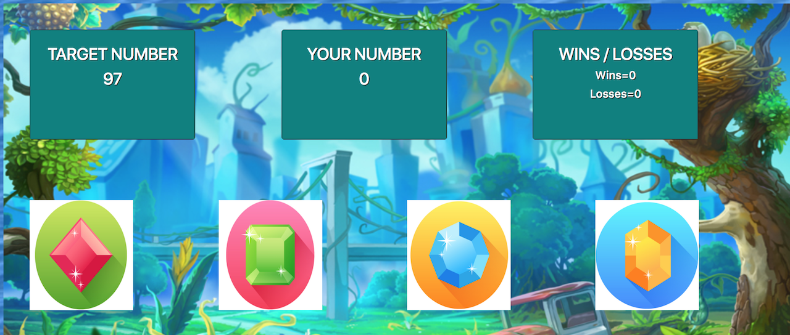

# unit-4-game

JQuery Crystals Collector Game

This is a game where the object is for the User Number to match the Target Number.
The user will itiate the game by clicking on one of four gems that are present on the screen. 
Upon clicking on a gem a random number between 1 and 12 will be generated and added to the Your Number window. 
Each time a new gem is clicked that number will be added to the Your Number window.
Each gem will generate a random value between 1 and 12.
Each Gem value will remain the same until the game is reset. 
If the user number matches the target number user wins and game is reset. 
If the user number exceeds the target number user loses and game is reset. 

Maintained by William Swensen
